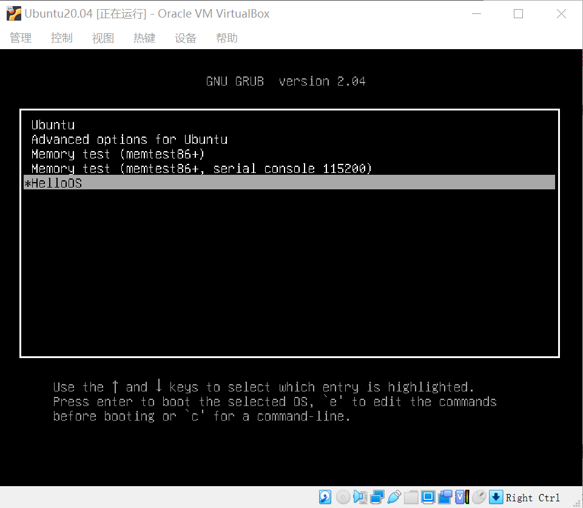
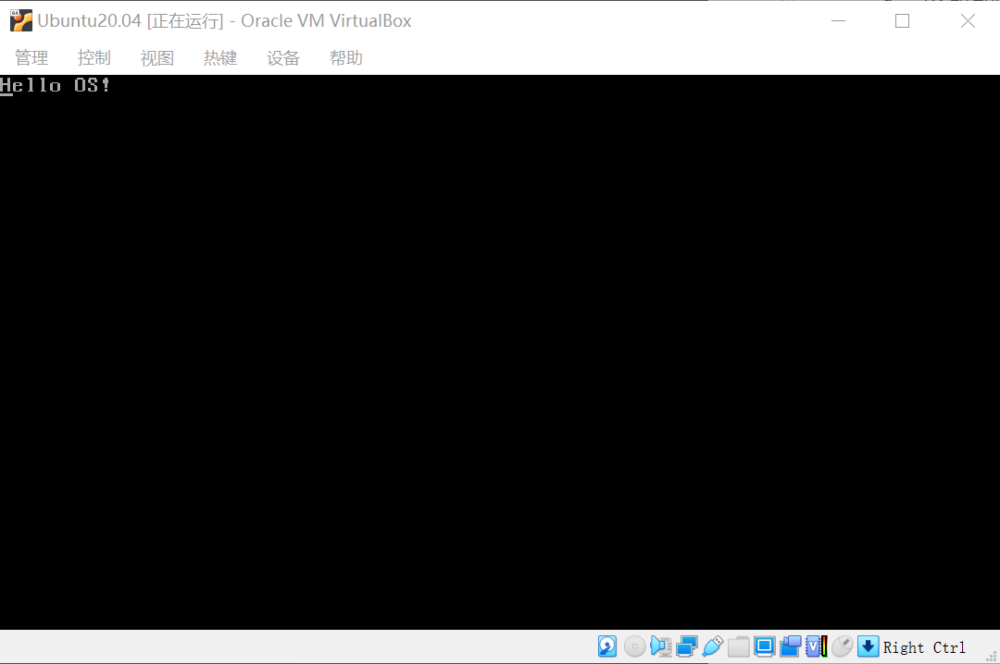

# 第1章 尝尝鲜：从一个Hello到另一个Hello

## 第1讲 程序的运行过程：从代码到机器运行

- 牛人和牛事
    1. Ken Thompson：开发了UNiplexed Information and Computing System（UNICS）操作系统，使用B语言和汇编语言在PDP-7机器上运行
    2. Dennis Ritchie：和Ken Thompson共同创造了C语言
    3. 阿兰·图灵：图灵机理论
    4. 冯诺依曼：冯诺依曼体系结构，提出了电子计算机使用二进制数制系统和储存程序，并按照程序顺序执行

- 程序编译过程：预处理器、编译程序、汇编程序、链接程序
```shell
# 预处理：加入头文件，替换宏
gcc HelloWorld.c -E -o HelloWorld.i
# 编译：包含预处理，将 C 程序转换成汇编程序
gcc HelloWorld.c -S -c -o HelloWorld.s
# 汇编：包含预处理和编译，将汇编程序转换成可链接的二进制程序
gcc HelloWorld.c -c -o HelloWorld.o 
# 链接：包含以上所有操作，将可链接的二进制程序和其它别的库链接在一起，形成可执行的程序文件
gcc HelloWorld.c -o HelloWorld
```

- 冯诺依曼体系结构的计算应具有的功能
    1. 把程序和数据装入到计算机中
    2. 必须具有长期记住程序、数据的中间结果及最终运算结果
    3. 完成各种算术、逻辑运算和数据传送等数据加工处理
    4. 根据需要控制程序走向，并能根据指令控制机器的各部件协调操作
    5. 能够按照要求将处理的数据结果显示给用户

- 计算机的五大基本组成部分
    1. 装载数据和程序的输入设备
    2. 记住程序和数据的存储器
    3. 完成数据加工处理的运算器
    4. 控制程序执行的控制器
    5. 显示处理结果的输出设备

## 第2讲 几行汇编几行C：实现一个最简单的内核

- Hello OS引导流程
    1. PC机加电
    2. 运行PC机BIOS固件：第一条指令用于检测和初始化CPU、内存及主板平台
    3. 加载可引导设备中的GRUB
    4. GRUB引导
    5. 加载硬盘分区中的Hello OS文件
    6. 运行Hello OS

-  Hello OS引导汇编代码：主要用于给代码段提供一块内存空间，用于加载C语言程序中的函数
    1. 定义GRUB的多引导协议头
    2. 关闭中断，设定CPU的工作模式
    3. 初始化CPU的寄存器和C语言的运行环境
    4. 设置CPU工作模式需要的数据

- 控制计算机屏幕：VESA标准
    1. 字符模式：把屏幕分成24行，每行80个字符，把这（24\*80）个位置映射到以0xb8000地址开始的内存中，每两个字节对应一个字符，其中一个字节是字符的ASCII码，另一个字节为字符的颜色值。
    2. 图形模式

- make工具：规则是首先有一个或者多个构建目标称为`target`；目标后面紧跟着用于构建该目标所需要的文件，目标下面是构建该目标所需要的命令及参数
    1. 宏定义：${宏名}会被替换成相应的字符串
    2. `.PHONY`：伪目标，在执行make时，可以指定这个目标来执行其所在规则定义的命令
    3. 通用规则：用于转换为依赖关系

## 运行结果


