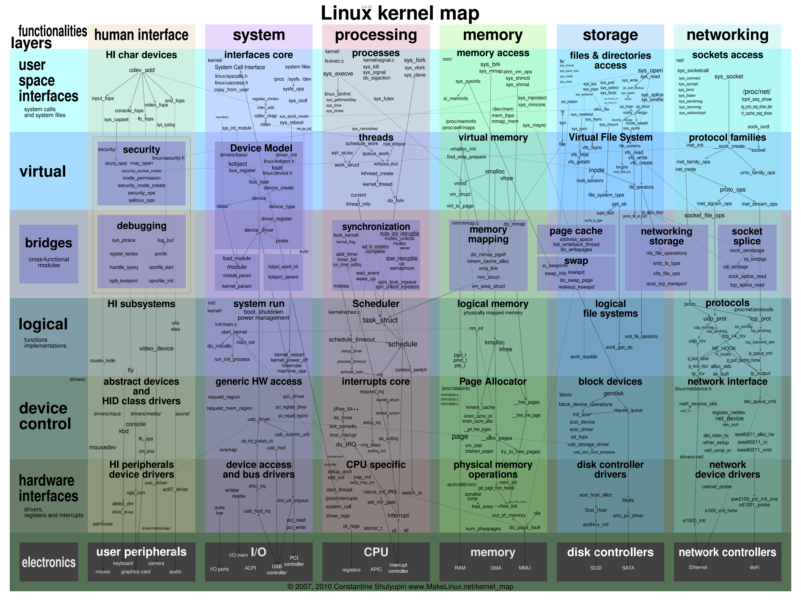

# 第2章 心有蓝图：设计

## 第3讲 黑盒之中有什么：内核结构与设计

- 计算机的硬件资源
    1. 总线：负责连接各种其它设备，是其它设备工作的基础
    2. CPU：即中央处理器，负责执行程序和处理数据运算
    3. 内存：负责储存运行时的代码和数据
    4. 硬盘：负责长久储存用户文件数据
    5. 网卡：负责计算机与计算机之间的通信
    6. 显卡：负责显示工作
    7. 各种 I/O 设备：如显示器，打印机，键盘，鼠标等

- 内核的内部组成：管理CPU、管理内存、管理硬盘、管理显卡、管理网卡、管理各种I/O设备

- 宏内核
    - 概念：将管理进程、管理内存、管理各种 I/O 设备、文件系统的代码、图形系统代码以及其它功能模块的所有代码经过编译，最后链接在一起，形成一个大的可执行程序
    - 缺点：没有模块化，没有扩展性、没有移植性，高度耦合在一起，一旦其中一个组件有漏洞，内核中所有的组件可能都会出问题

- 微内核
    - 概念：仅仅包含进程调度、处理中断、内存空间映射、进程间通信等功能，通过“消息“的进程间通信机制进行服务请求
    - 优点：系统结构清晰、具有良好移植性、相当好的伸缩性和扩展性

- 分离硬件的相关性：把操作硬件和处理硬件功能差异的代码抽离出来，形成独立的软件抽象层，对外提供相应的接口

- 操作系统内核的层次
1. 内核接口层：定义一系列接口，包括定义一套UNIX接口的子集、检查参数是否合法
2. 内核功能层：完成各种实际功能，主要模块包括进程管理、内存管理、中断管理、设备管理
3. 内核硬件层：包括具体硬件平台相关的代码，包括初始化、CPU控制、中断处理、物理内存管理、平台其他相关的功能

## 第4讲 震撼的Linux全景图：业界成熟的内核架构长什么样？

### 1 Linux基本介绍

- Linux：全称 GNU/Linux，是一套免费使用和自由传播的操作系统，支持类 UNIX、POSIX 标准接口，也支持多用户、多进程、多线程，可以在多 CPU 的机器上运行。
- 基本思想：一切都是文件，每个文件都有确定的用途；支持多用户，各个用户对于自己的文件有自己特殊的权限，支持多任务，可以使多个程序同时并独立地运行。

### 2 Linux内核架构

### 3 Darwin-XNU 内核

- Mach内核层：提供最基本的操作系统服务，包括简单的进程、线程、IPC通信、虚拟内存设备驱动相关的功能服务
- BSD内核层：提供一整套操作系统服务，包括强大的安全特性，完善的网络服务，各种文件系统的支持

### 4 Windows NT 内核

-  Windows NT是微软于1993年推出的面向工作站、网络服务器和大型计算机的网络操作系统，也可做PC操作系统
-  Windows NT内核架构： HAL层上定义了小内核，小内核之上是内核执行体，主要完成进程、内存、配置、I/O文件缓存、电源与即插即用、安全等相关的服务，执行体之间相互独立；所有的设备驱动和文件系统都由I/O管理器统一管理