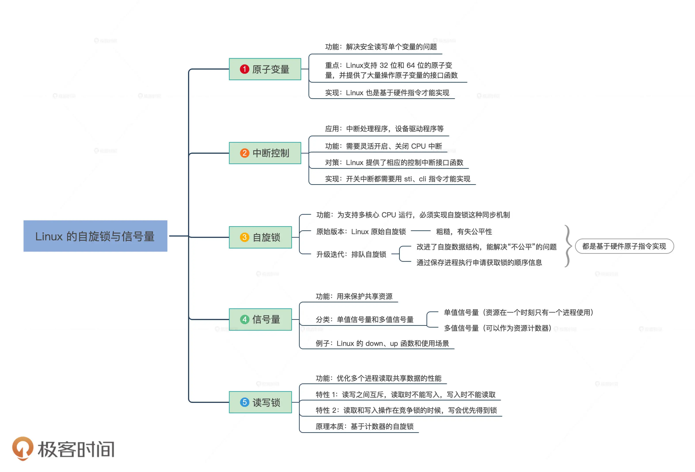

# 第4章 基本法：同步原语

## 第8讲 锁：并发操作中，解决数据同步的四种方法

### 1 原子操作

- 适用场景：单体变量
- 使用x86平台的原子操作：原子加、原子减、原子读写等
- 在C函数中按照特定的方式嵌入汇编代码
```c
// 定义一个原子类型
typedef struct s_ATOMIC{
    volatile s32_t a_count; // 在变量前加上volatile，是为了禁止编译器优化，使其每次都从内存中加载变量
}atomic_t;

static inline void atomic_add(int i, atomic_t *v)
{
        __asm__ __volatile__("lock;" "addl %1,%0"
                     : "+m" (v->a_count)
                     : "ir" (i));
}
// "lock;" "addl %1,%0" 是汇编指令部分，%1,%0是占位符，它表示输出、输入列表中变量或表态式，占位符的数字从输出部分开始依次增加，这些变量或者表态式会被GCC处理成寄存器、内存、立即数放在指令中。 
// : "+m" (v->a_count) 是输出列表部分，“+m”表示(v->a_count)和内存地址关联
// : "ir" (i) 是输入列表部分，“ir” 表示i是和立即数或者寄存器关联
```

### 2 中断控制

- 适用场景：复杂变量
- 控制中断：在关闭中断函数中先保存eflags寄存器，然后执行cli指令，在开启中断函数时，直接恢复之前保存的eflags寄存器
```c

typedef u32_t cpuflg_t;
static inline void hal_save_flags_cli(cpuflg_t* flags)
{
     __asm__ __volatile__(
            "pushfl \t\n" // 把eflags寄存器压入当前栈顶
            "cli    \t\n" // 关闭中断
            "popl %0 \t\n"// 把当前栈顶弹出到flags为地址的内存中        
            : "=m"(*flags)
            :
            : "memory"
          );
}
static inline void hal_restore_flags_sti(cpuflg_t* flags)
{
    __asm__ __volatile__(
              "pushl %0 \t\n"// 把flags为地址处的值寄存器压入当前栈顶
              "popfl \t\n"   // 把当前栈顶弹出到eflags寄存器中
              :
              : "m"(*flags)
              : "memory"
              );
}
```

### 3 自旋锁

- 适用场景：协调多核CPU
- 原理：读取锁变量，判断其值是否已经加锁，如果未加锁则执行加锁，然后返回，表示加锁成功；如果已经加锁了，就要返回第一步继续执行后续步骤
```c
// 自旋锁结构
typedef struct
{
     volatile u32_t lock; // volatile可以防止编译器优化，保证其它代码始终从内存加载lock变量的值 
} spinlock_t;
// 锁初始化函数
static inline void x86_spin_lock_init(spinlock_t * lock)
{
     lock->lock = 0; // 锁值初始化为0是未加锁状态
}
// 加锁函数
static inline void x86_spin_lock_disable_irq(spinlock_t * lock,cpuflg_t* flags)
{
    __asm__ __volatile__(
    "pushfq                 \n\t"
    "cli                    \n\t"
    "popq %0                \n\t"
    "1:         \n\t"
    "lock; xchg  %1, %2 \n\t" // 把值为1的寄存器和lock内存中的值进行交换
    "cmpl   $0,%1       \n\t" // 用0和交换回来的值进行比较
    "jnz    2f      \n\t"     // 不等于0则跳转后面2标号处运行
    "jmp    3f      \n"       // 若等于0则跳转后面3标号处返回
    "2:         \n\t"
    "cmpl   $0,%2       \n\t" // 用0和lock内存中的值进行比较
    "jne    2b      \n\t"     // 若不等于0则跳转到前面2标号处运行继续比较  
    "jmp    1b      \n\t"     // 若等于0则跳转到前面1标号处运行，交换并加锁
    "3:     \n"     
     :"=m"(*flags)
    : "r"(1), "m"(*lock));
}
// 解锁函数
static inline void x86_spin_unlock_enabled_irq(spinlock_t* lock,cpuflg_t* flags)
{
    __asm__ __volatile__(
    "movl   $0, %0\n\t" // 解锁把lock内存中的值设为0就行
    "pushq %1 \n\t"
    "popfq \n\t"
    :
    : "m"(*lock), "m"(*flags));
}
```

### 4 信号量

- 适用场景：长时间等待的场景
- 特点：对资源数据进行保护（同一时刻只有一个代码执行流访问），能够在资源无法满足的情况下，让CPU可以执行其他任务
- 能够解决的问题：等待、互斥、唤醒
- 信号量的使用步骤：
    1. 获取信号量
    2. 代码执行流开始执行相关操作
    3. 释放信号量

```c
#define SEM_FLG_MUTEX 0
#define SEM_FLG_MULTI 1
#define SEM_MUTEX_ONE_LOCK 1
#define SEM_MULTI_LOCK 0
// 等待链数据结构，用于挂载等待代码执行流（线程）的结构，里面有用于挂载代码执行流的链表和计数器变量，这里我们先不深入研究这个数据结构。
typedef struct s_KWLST
{   
    spinlock_t wl_lock;
    uint_t   wl_tdnr;
    list_h_t wl_list;
}kwlst_t;
// 信号量数据结构
typedef struct s_SEM
{
    spinlock_t sem_lock; // 维护sem_t自身数据的自旋锁
    uint_t sem_flg;      // 信号量相关的标志
    sint_t sem_count;    // 信号量计数值
    kwlst_t sem_waitlst; // 用于挂载等待代码执行流（线程）结构
}sem_t;

// 1. 获取信号量
void krlsem_down(sem_t* sem)
{
    cpuflg_t cpufg;
start_step:    
    krlspinlock_cli(&sem->sem_lock,&cpufg);
    if(sem->sem_count<1)
    { // 如果信号量值小于1,则让代码执行流（线程）睡眠
        krlwlst_wait(&sem->sem_waitlst);
        krlspinunlock_sti(&sem->sem_lock,&cpufg);
        krlschedul(); // 2. 切换代码执行流，下次恢复执行时依然从下一行开始执行，所以要goto开始处重新获取信号量
        goto start_step; 
    }
    sem->sem_count--; // 信号量值减1,表示成功获取信号量
    krlspinunlock_sti(&sem->sem_lock,&cpufg);
    return;
}
//3. 释放信号量
void krlsem_up(sem_t* sem)
{
    cpuflg_t cpufg;
    krlspinlock_cli(&sem->sem_lock,&cpufg);
    sem->sem_count++; // 释放信号量
    if(sem->sem_count<1)
    {// 如果小于1,则说数据结构出错了，挂起系统
        krlspinunlock_sti(&sem->sem_lock,&cpufg);
        hal_sysdie("sem up err");
    }
    // 唤醒该信号量上所有等待的代码执行流（线程）
    krlwlst_allup(&sem->sem_waitlst);
    krlspinunlock_sti(&sem->sem_lock,&cpufg);
    krlsched_set_schedflgs();
    return;
}
```

## 第9讲：瞧一瞧Linux：Linux的自旋锁和信号量如何实现？

### 1 Linux的原子变量

- Linux提供了一个原子类型变量`atomic_t`
- 单核心CPU是不需要`lock`前缀的，只要在多核心CPU下才需要加上`lock`前缀
- `volatile int *`：表示这是对内存地址读写，不要有优化动作，每次都必须强制写入内存或从内存读取

```c
typedef struct {
    int counter;
} atomic_t;  // 常用的32位的原子变量类型
#ifdef CONFIG_64BIT
typedef struct {
    s64 counter;
} atomic64_t; // 64位的原子变量类型
#endif

//原子加上一个具体的值
static __always_inline void arch_atomic_add(int i, atomic_t *v)
{ 
    asm volatile(LOCK_PREFIX "addl %1,%0" 
            : "+m" (v->counter) 
            : "ir" (i) : "memory");
}
```

### 2 Linux控制中断

- Linux通过定义的方式对一些底层函数进行了包装
- 带有`native_`前缀的函数主要是为了支持不同的硬件平台

```c
// __unqual_scalar_typeof表示声明一个非限定的标量类型，非标量类型保持不变。即返回x变量的类型，这是GCC的功能，typeof只是纯粹返回x的类型。
#define __READ_ONCE(x)  \
(*(const volatile __unqual_scalar_typeof(x) *)&(x))

#define __WRITE_ONCE(x, val) \
do {*(volatile typeof(x) *)&(x) = (val);} while (0)

// 如果 x 是int类型则返回“int” 
#define __READ_ONCE(x)  \
(*(const volatile int *)&(x))

#define __WRITE_ONCE(x, val) \
do {*(volatile int *)&(x) = (val);} while (0) 

// 实际保存eflags寄存器
extern __always_inline unsigned long native_save_fl(void){
    unsigned long flags;
    asm volatile("# __raw_save_flags\n\t"
                 "pushf ; pop %0":"=rm"(flags)::"memory");
    return flags;
}
// 实际恢复eflags寄存器
extern inline void native_restore_fl(unsigned long flags){
    asm volatile("push %0 ; popf"::"g"(flags):"memory","cc");
}
// 实际开启中断
static __always_inline void native_irq_enable(void){
    asm volatile("sti":::"memory");
}
// arch层开启中断
static __always_inline void arch_local_irq_enable(void){ 
    native_irq_enable();
}
// arch层保存eflags寄存器
static __always_inline unsigned long           arch_local_save_flags(void){
    return native_save_fl();
}
// arch层恢复eflags寄存器
static  __always_inline void arch_local_irq_restore(unsigned long flags){
    native_restore_fl(flags);
}
// raw层开启中断宏
#define raw_local_irq_enable()      arch_local_irq_enable()
// raw层保存恢复eflags寄存器宏
#define raw_local_irq_save(flags)           \
    do {                        \
        typecheck(unsigned long, flags);    \
        flags = arch_local_irq_save();      \
    } while (0)
    
#define raw_local_irq_restore(flags)            \
    do {                        \
        typecheck(unsigned long, flags);    \
        arch_local_irq_restore(flags);      \
    } while (0)
    
#define raw_local_save_flags(flags)         \
    do {                        \
        typecheck(unsigned long, flags);    \
        flags = arch_local_save_flags();    \
    } while (0)
// 通用层接口宏 
#define local_irq_enable()              \
    do { \
        raw_local_irq_enable();         \
    } while (0)
```

### 3 Linux自旋锁

- 原始自旋锁：使用一个整数表示，1表示锁未被占用，0或者负数表示被占用

```c
// 最底层的自旋锁数据结构
typedef struct{
volatile unsigned long lock;// 真正的锁值变量，用volatile标识
} spinlock_t;


#define spin_unlock_string \  
    "movb $1,%0" \  // 写入1表示解锁
    :"=m" (lock->lock) : : "memory"

#define spin_lock_string \
  "\n1:\t" \  
    "lock ; decb %0\n\t" \           // 原子减1
  "js 2f\n" \                        // 当结果小于0则跳转到标号2处，表示加锁失败
    ".section .text.lock,\"ax\"\n" \ // 重新定义一个代码段，这是优化技术，避免后面的代码填充cache，因为大部分情况会加锁成功，链接器会处理好这个代码段的
  "2:\t" \  
    "cmpb $0,%0\n\t" \  // 和0比较
    "rep;nop\n\t" \     // 空指令
    "jle 2b\n\t" \      // 小于或等于0跳转到标号2
    "jmp 1b\n" \        // 跳转到标号1  
    ".previous"
// 获取自旋锁
static inline void spin_lock(spinlock_t*lock){
    __asm__ __volatile__(
    spin_lock_string
    :"=m"(lock->lock)::"memory"
    );
}
// 释放自旋锁
static inline void spin_unlock(spinlock_t*lock){
__asm__ __volatile__(
    spin_unlock_string
    );
}
```

- 排队自旋锁：通过总线仲裁协议决定访问内存的次序，使用锁持有者（owner）和未来锁申请者（next）来决定自旋锁的状态

```c
// RAW层的自旋锁数据结构
typedef struct raw_spinlock{
    unsigned int slock;// 真正的锁值变量
}raw_spinlock_t;
// 最上层的自旋锁数据结构
typedef struct spinlock{
    struct raw_spinlock rlock;
}spinlock_t;
// Linux没有这样的结构，这只是为了描述方便
typedef struct raw_spinlock{
    union {
        unsigned int slock;// 真正的锁值变量
        struct {
        u16 owner;
        u16 next;
        }
    }
}raw_spinlock_t;


static inline void __raw_spin_lock(raw_spinlock_t*lock){
    int inc = 0x00010000;
    int tmp;
    __asm__ __volatile__(
        "lock ; xaddl %0, %1\n" // 将inc和slock交换，然后 inc=inc+slock
                                // 相当于原子读取next和owner并对next+1
        "movzwl %w0, %2\n\t"    // 将inc的低16位做0扩展后送tmp tmp=(u16)inc
        "shrl $16, %0\n\t"      // 将inc右移16位 inc=inc>>16
        "1:\t"
        "cmpl %0, %2\n\t"       // 比较inc和tmp，即比较next和owner 
        "je 2f\n\t"             // 相等则跳转到标号2处返回
        "rep ; nop\n\t"         // 空指令
        "movzwl %1, %2\n\t"     // 将slock的低16位做0扩展后送tmp 即tmp=owner
        "jmp 1b\n"              // 跳转到标号1处继续比较
        "2:"
        :"+Q"(inc),"+m"(lock->slock),"=r"(tmp)
        ::"memory","cc"
        );
}

#define UNLOCK_LOCK_PREFIX LOCK_PREFIX
static inline void __raw_spin_unlock(raw_spinlock_t*lock){
    __asm__ __volatile__(
        UNLOCK_LOCK_PREFIX"incw %0" // 将slock的低16位加1 即owner+1
        :"+m"(lock->slock)
        ::"memory","cc");
}
```

### 4 Linux信号量

- 信号量的判断逻辑：信号量的值为正的时候，所申请的进程可以锁定使用它；若为 0，说明它被其它进程占用，申请的进程要进入睡眠队列中，等待被唤醒
- 优势：可以使申请失败的进程睡眠，还可以作为资源计数器使用

### 5 Linux读写锁

- 定义：称为共享-独占（shared-exclusive）锁，当读写锁用读取模式加锁时，以共享模式上锁，当以写入修改模式加锁时，以独占模式上锁（互斥）
- 适用场景：读取数据的频率远大于修改数据的频率的场景
- 读写锁的工作流程：
    1. 当共享数据没有锁的时候，读取的加锁操作和写入的加锁操作都可以满足。
    2. 当共享数据有读锁的时候，所有的读取加锁操作都可以满足，写入的加锁操作不能满足，读写是互斥的。
    3. 当共享数据有写锁的时候，所有的读取的加锁操作都不能满足，所有的写入的加锁操作也不能满足，读与写之间是互斥的，写与写之间也是互斥的。
- 读写锁的获取、释放流程：
    1. 获取读锁时，锁值变量`lock`计数减1，判断结果的符号位是否为1。若结果符号位为0时，获取读锁成功，即表示lock大于0。
    2. 获取读锁时，锁值变量`lock`计数减1，判断结果的符号位是否为1。若结果符号位为1时，获取读锁失败，表示此时读写锁被修改数据的进程占有，此时调用`__read_lock_failed`失败处理函数，循环测试`lock+1`的值，直到结果的值大于等于1。
    3. 获取写锁时，锁值变量`lock`计数减去`RW_LOCK_BIAS_STR`，即`lock-0x01000000`，判断结果是否为0。若结果为0时，表示获取写锁成功。
    4. 获取写锁时，锁值变量`lock`计数减去`RW_LOCK_BIAS_STR`，即`lock-0x01000000`，判断结果是否为0。若结果不为0时，获取写锁失败，表示此时有读取数据的进程占有读锁或有修改数据的进程占有写锁，此时调用`__write_lock_failed`失败处理函数，循环测试 `lock+0x01000000`，直到结果的值等于0x01000000。

## 总结


