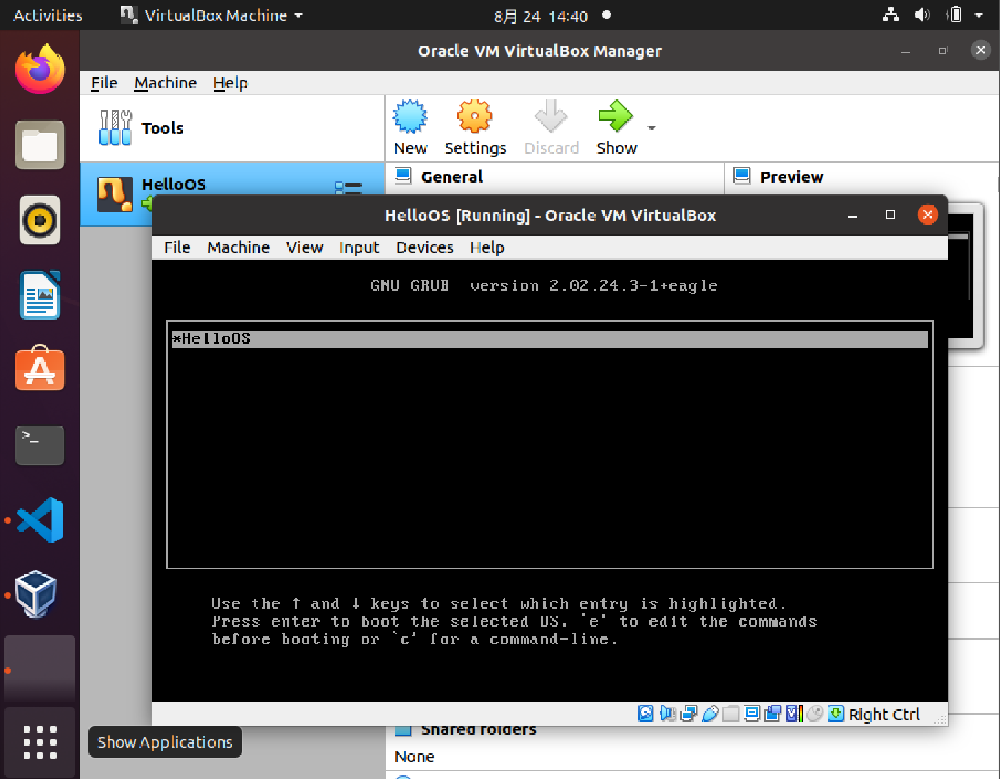
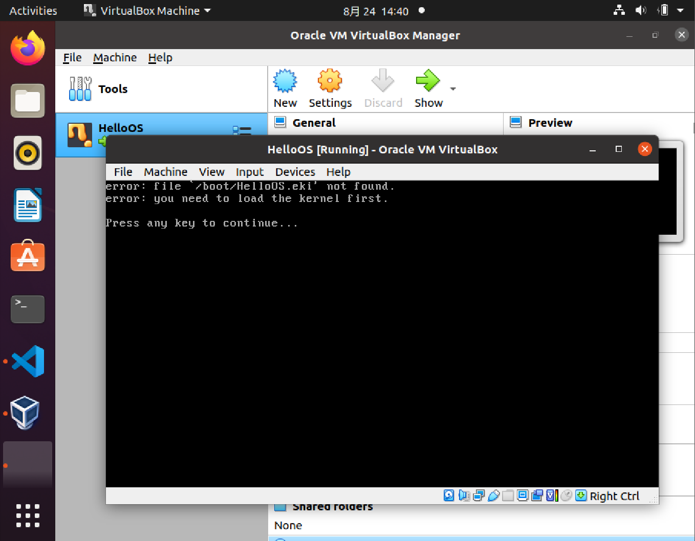

# 第5章 夺权：启动初始化

## 第10讲 设置工作模式与环境（上）：建立计算机

### 1  内核映像格式
内存映像格式主要包括二级引导器的模块、内核模块、图片和字库文件。
```c
// 映像文件头描述符
typedef struct s_mlosrddsc
{
    u64_t mdc_mgic;      // 映像文件标识
    u64_t mdc_sfsum;     // 未使用
    u64_t mdc_sfsoff;    // 未使用
    u64_t mdc_sfeoff;    // 未使用
    u64_t mdc_sfrlsz;    // 未使用
    u64_t mdc_ldrbk_s;   // 映像文件中二级引导器的开始偏移
    u64_t mdc_ldrbk_e;   // 映像文件中二级引导器的结束偏移
    u64_t mdc_ldrbk_rsz; // 映像文件中二级引导器的实际大小
    u64_t mdc_ldrbk_sum; // 映像文件中二级引导器的校验和
    u64_t mdc_fhdbk_s;   // 映像文件中文件头描述的开始偏移
    u64_t mdc_fhdbk_e;   // 映像文件中文件头描述的结束偏移
    u64_t mdc_fhdbk_rsz; // 映像文件中文件头描述的实际大小
    u64_t mdc_fhdbk_sum; // 映像文件中文件头描述的校验和
    u64_t mdc_filbk_s;   // 映像文件中文件数据的开始偏移
    u64_t mdc_filbk_e;   // 映像文件中文件数据的结束偏移
    u64_t mdc_filbk_rsz; // 映像文件中文件数据的实际大小
    u64_t mdc_filbk_sum; // 映像文件中文件数据的校验和
    u64_t mdc_ldrcodenr; // 映像文件中二级引导器的文件头描述符的索引号
    u64_t mdc_fhdnr;     // 映像文件中文件头描述符有多少个
    u64_t mdc_filnr;     // 映像文件中文件头有多少个
    u64_t mdc_endgic;    // 映像文件结束标识
    u64_t mdc_rv;        // 映像文件版本
}mlosrddsc_t;

#define FHDSC_NMAX 192  // 文件名长度
// 文件头描述符
typedef struct s_fhdsc
{
    u64_t fhd_type;              // 文件类型
    u64_t fhd_subtype;           // 文件子类型
    u64_t fhd_stuts;             // 文件状态
    u64_t fhd_id;                // 文件id
    u64_t fhd_intsfsoff;         // 文件在映像文件位置开始偏移
    u64_t fhd_intsfend;          // 文件在映像文件的结束偏移
    u64_t fhd_frealsz;           // 文件实际大小
    u64_t fhd_fsum;              // 文件校验和
    char   fhd_name[FHDSC_NMAX]; // 文件名
}fhdsc_t;
```

- 映像打包工具：lmoskrlimg
```shell
lmoskrlimg -m k -lhf GRUB头文件 -o 映像文件 -f 输入的文件列表
-m 表示模式 只能是k内核模式
-lhf 表示后面跟上GRUB头文件
-o 表示输出的映像文件名 
-f 表示输入文件列表
例如：lmoskrlimg -m k -lhf grubhead.bin -o kernel.img -f file1.bin file2.bin file3.bin file4.bin 
```

### 2  安装VirtualBox虚拟机
```shell
sudo apt-get install virtualbox-6.1
```
注：新建虚拟机时，不用添加虚拟硬盘

### 3 创建虚拟硬盘
- 手动创建虚拟硬盘
```shell
dd bs=512 if=/dev/zero of=hd.img count=204800
说明：
bs:表示块大小，这里是512字节
if：表示输入文件，/dev/zero就是Linux下专门返回0数据的设备文件，读取它就返回0
of：表示输出文件，即我们的硬盘文件。
count：表示输出多少块
```

- 格式化硬盘
    1. 将虚拟硬盘文件变成Linux下的回环设备

    ```shell
    sudo losetup /dev/loop0 hd.img
    ```

    2. 将losetup用于设置回环设备，并格式化设备，建立EXT4文件系统

    ```shell
    sudo mkfs.ext4 -q /dev/loop0  
    ```

    3. 挂载硬盘文件创建boot目录
    
    ```shell
    sudo mount -o loop ./hd.img ./hdisk/ ;挂载硬盘文件
    sudo mkdir ./hdisk/boot/ ;建立boot目录
    ```

### 4 安装GRUB
1. 安装引导GRUB引导程序

```shell
sudo grub-install --boot-directory=./hdisk/boot/ --force --allow-floppy /dev/loop0

说明：
--boot-directory 指向先前我们在虚拟硬盘中建立的boot目录。
--force --allow-floppy ：指向我们的虚拟硬盘设备文件/dev/loop0
```

2. 配置grub.cfg
```shell
sudo mkdir -p ./hdisk/boot/grub
sudo vim ./hdisk/boot/grub/grub.cfg
```

在文件中写入如下内容：

```shell
menuentry 'HelloOS' {
insmod part_msdos
insmod ext2
set root='hd0,msdos1' #我们的硬盘只有一个分区所以是'hd0,msdos1'
multiboot2 /boot/HelloOS.eki #加载boot目录下的HelloOS.eki文件
boot #引导启动
}
set timeout_style=menu
if [ "${timeout}" = 0 ]; then
set timeout=10 #等待10秒钟自动启动
fi
```

### 5 转换虚拟磁盘的格式与挂载
- 转换虚拟硬盘格式

```shell
VBoxManage convertfromraw ./hd.img --format VDI ./hd.vdi
;convertfromraw 指向原始格式文件
；--format VDI  表示转换成虚拟需要的VDI格式
```

- 安装虚拟硬盘

```shell
# 第一步 SATA的硬盘其控制器是intelAHCI
VBoxManage storagectl HelloOS --name "SATA" --add sata --controller IntelAhci --portcount 1
# 第二步 删除虚拟硬盘UUID并重新分配
VBoxManage closemedium disk ./hd.vdi
# 将虚拟硬盘挂到虚拟机的硬盘控制器
VBoxManage storageattach HelloOS --storagectl "SATA" --port 1 --device 0 --type hdd --medium ./hd.vdi
```

### 6 启动虚拟机
```shell
# 启动虚拟机
VBoxManage startvm HelloOS 
```





## 第11讲 设置工作模式与环境（中）：建造二级引导器

### 1 二级引导器 
- 主要作用：解析内核文件、收集机器环境信息
- 规划二级引导器

|     文件名      | 功能                                              |
| :-------------: | ------------------------------------------------- |
| imginithead.asm | GRUB头的编译部分                                  |
|   inithead.c    | GRUB头的C语言部分，用于放置二级引导器到指定内存中 |
| realintsve.asm  | 实现调用BIOS中断的功能                            |
|  ldrkrl32.asm   | 二级引导器核心入口汇编部分                        |
|  ldrkrlentry.c  | 二级引导器核心入口                                |
|  bstartparm.c   | 实现收集机器信息建立页面数据                      |
|    chkcpmm.c    | 实现检查CPU工作模式和内存视图                     |
|      fs.c       | 实现解析映像文件的功能                            |
|     graph.c     | 实现切换显卡图形模式                              |
|    vgastr.c     | 实现字符串输出                                    |

### 2 实现GRUB头

- 组成文件：主要由两个文件组成imginithead.asm汇编文件（能让GRUB识别、设置C语言运行环境，用于调用C函数）、inithead.c文件（查找二级引导器的核心文件initldrkrl.bin，并将其放置到特定的内存地址上）
- imginithead.asm主要作用：初始化CPU寄存器，加载GDT，切换到CPU的保护模式
    1. 定义GRUB1和GRUB2的头结构
    2. 关闭中断并加载GDT
    3. 初始化段寄存器、通用寄存器和栈寄存器，为了给调用inithead_entry这个C函数做准备
    4. 调用inithead_entry函数
- inithead.c文件：`inithead_entry`函数主要调用`write_realintsvefile()`、`write_ldrkrlfile()`函数，把映像文件中的`initldrsve.bin`文件和`initldrkrl.bin`文件写入到特定的内存地址空间中

### 3 进入二级引导器

1. 加载GDT地址到GDTR寄存器、加载IDT地址到IDTR寄存器
2. 初始化CPU相关的寄存器
3. 调用二级引导器的主函数ldrkrl_entry

### 4 调用BIOS中断

- 主要作用：获取内存布局信息，设置显卡图形模式的必要步骤
- 需要处理的问题：
    1. 保存C语言环境下的CPU上下文，即保护模式下的所有通用寄存器、段寄存器、程序指针寄存器、栈寄存器，并将它们都保存在内存中。
    2. 切换到实模式，调用BIOS中断，把返回的相关结果保存在内存中。
    3. 切换到保护模式，重新加载第1步中保存的寄存器，恢复C语言代码的执行状态

## 第12讲 设置工作模式与环境（下）：探查和收集信息

### 1 检查与收集机器信息

- 检查CPU：检查CPU是否支持CPUID指令，用CPUID指令检查CPU是否支持64位长模式
- 获取内存布局：
